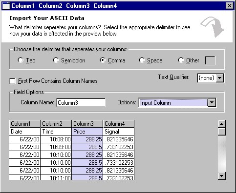



## FileReader Classes

### Description

Two class modules that load any size flat file with delimiters (tab, comma, space, etc.) into memory. Once loaded, you can reference any cell that has been loaded... sort of like Excel.
 
### More Info
 

             |
---                |---
**Submitted On**   |2001-12-21 02:31:42
**By**             |[RGSoftware](https://github.com/Planet-Source-Code/PSCIndex/blob/master/ByAuthor/rgsoftware.md)
**Level**          |Intermediate
**User Rating**    |4.6 (32 globes from 7 users)
**Compatibility**  |VB 4\.0 \(16\-bit\), VB 4\.0 \(32\-bit\), VB 5\.0, VB 6\.0, VBA MS Excel
**Category**       |[Files/ File Controls/ Input/ Output](https://github.com/Planet-Source-Code/PSCIndex/blob/master/ByCategory/files-file-controls-input-output__1-3.md)
**World**          |[Visual Basic](https://github.com/Planet-Source-Code/PSCIndex/blob/master/ByWorld/visual-basic.md)
**Archive File**   |[FileReader4334912212001\.zip](https://github.com/Planet-Source-Code/rgsoftware-filereader-classes__1-25323/archive/master.zip)

